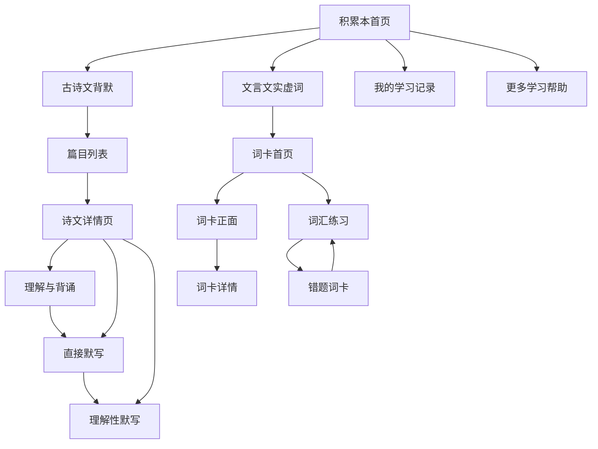
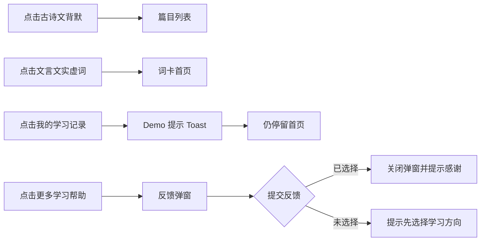
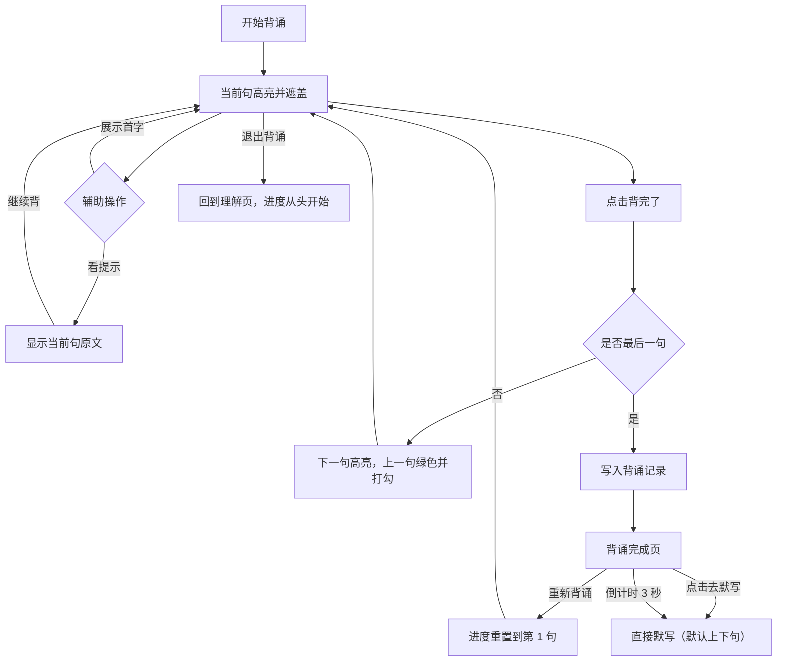
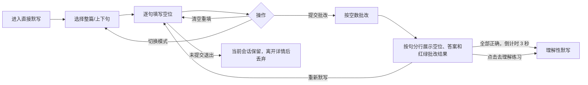
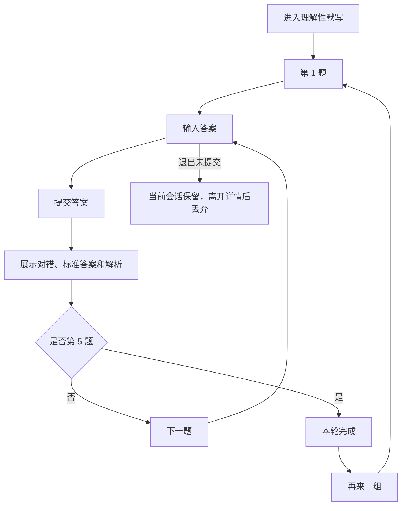
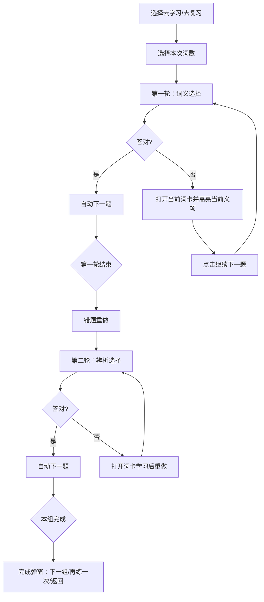

# 语文自学“积累本”产品需求文档（当前版）

## 1. 修订记录

| 日期 | 修订内容 | 修订人 |
|---|---|---|
| 2026-09-09 | 基于语文积累本 Demo 及页面批注完成全文重写；补充页面模块、数据口径、交互原则、流程图和异常边界 | Codex |

## 2. 产品概述

### 2.1 背景

“积累本”是学生平板中的语文自学模块，面向初高中学生的课后同步学习。首期围绕课内古诗文和文言文实虚词，解决学生“理解后不会背、背过后不会写、知道字面义但不会辨析”的问题。

### 2.2 产品目标

- 帮助学生按照“理解 → 背诵 → 检测”的路径完成古诗文学习。
- 提供课内古诗文逐句背诵、直接默写和理解性默写闭环。
- 通过词卡、词义选择和辨析选择，帮助学生积累文言文实词、虚词。
- 用清晰的“背、默、练”状态和学习记录，让学生知道下一步做什么。

### 2.3 本期范围

本期 Demo 和 PRD 包含：

- 积累本首页；
- 古诗文篇目列表；
- 古诗文详情页：理解与背诵、直接默写、理解性默写；
- 文言文实虚词词卡首页、词卡详情和两轮词汇练习；
- 累计学习概览和学习记录入口的 Demo 展示规则；
- 学生侧本地状态、结果反馈和异常边界。

本期不包含：教师布置任务、课堂实时发起、手写识别、语音背诵测评、AI 语义批改、真实复习日期调度和教师端页面。

## 3. Demo 页面与信息架构

### 3.1 通用交互原则

1. 所有页面保持横屏布局；页面内容过长时，在内容区域内部滚动，不改变整体页面方向。
2. 主按钮用于推进当前主流程，次按钮用于返回、查看辅助内容或清除输入。
3. 已提交内容必须锁定，避免学生在看到结果后修改答案。
4. 未提交内容不形成正式学习记录；正式记录只在“背诵全文完成”或“提交批改”时写入。
5. 同一篇目中“背、默、练”三个模块的进度相互独立；一个模块完成不代表另外两个模块完成。
6. 页面返回不改变已经形成的正式记录；未提交草稿按本 PRD 的边界规则处理。

## 4. 积累本首页

### 4.1 页面模块

| 页面区域 | 内容 |
|---|---|
| 顶部标题区 | “语文自学 · 学习入口”、页面标题“积累本”、说明文案“把课内积累变成每天都能完成的小练习” |
| 我的学习记录 | 入口按钮；当前 Demo 点击后提示“学习进度 Demo 将在后续版本展开”，停留在首页 |
| 累计学习概览 | 累计完成篇目、累计学会词数两个指标 |
| 功能入口 | 古诗文背默、文言文实虚词两个模块卡片 |
| 更多内容 | “还有什么学习帮助”反馈卡片，点击打开反馈弹窗 |

### 4.2 累计学习概览规则

Demo 使用固定示例数据：完成篇目 2 篇、学会词数 4 个。该数据用于展示页面效果，不随 Demo 内的操作实时变化。

正式产品使用以下口径：

- 完成篇目 `X`：完成过至少 1 组理解性默写的去重篇目数。同一篇目完成多组只计 1 篇；只完成背诵或直接默写，不计入该指标。
- 学会词数 `Y`：被学生标记为“已学会”的去重词目数。同一个词目重复标记或重复练习只计 1 个；取消“已学会”后从指标中扣除。
- 没有数据时，两个指标均展示 0。

### 4.3 首页按钮链路

## 5. 古诗文篇目列表

### 5.1 页面模块

- 教材版本下拉框；
- 册次下拉框；
- 单元筛选按钮：第三单元、第四单元、全部篇目；
- 随机抽查按钮；
- 篇目卡片：篇名、作者、朝代、所属单元、译文摘要；
- “背、默、练”三个独立状态标识。

### 5.2 筛选规则

1. 先按教材版本筛选，再按册次筛选，最后按单元筛选。
2. 选择“全部篇目”时，展示当前版本和册次下的全部篇目。
3. 筛选条件改变后立即刷新列表，不改变已保存的学习记录。
4. 当前范围没有篇目时展示空状态，不允许进入不存在的篇目。
5. 点击篇目卡片进入该篇详情页，默认打开“理解与背诵”。

### 5.3 状态图例与判断规则

| 标识 | 默认状态 | 完成状态 | 判断规则 |
|---|---|---|---|
| 背 | 灰色 | 绿色 | 默认灰色；至少完成过 1 次全文背诵后变绿色 |
| 默 | 灰色/进行中 | 绿色 | 未提交为灰色；已提交但未达到 100% 为进行中；历史最高正确率达到 100% 为完成 |
| 练 | 灰色/进行中 | 绿色 | 未提交为灰色；已有提交但本轮未完成为进行中；完成一轮 5 题后为完成 |

“背”不使用部分完成的颜色。背诵中途退出或只完成部分句子，不能改变篇目卡片的“背”状态。

### 5.4 随机抽查

- 在当前筛选范围内汇总所有篇目的理解性默写题目；
- 随机抽取 1 个篇目，并从该篇目题库生成本轮题目；
- Demo 每轮固定 5 题；
- 无可用题目时停留在列表页，提示“当前筛选范围暂无可抽查题目”；
- 随机抽查只进入“理解性默写”，不改变“背”和“默”的状态。

## 6. 古诗文详情页公共结构

### 6.1 页面模块

| 区域 | 内容 |
|---|---|
| 左侧篇目卡 | “诗”图标、篇名、作者、朝代、单元、更换篇目 |
| 左侧学习记录 | 本篇“背、默、练”三行数据 |
| 顶部页签 | 理解与背诵、直接默写、理解性默写 |
| 主内容区 | 当前页签内容和操作按钮 |

### 6.2 页签交互规则

- 进入详情页默认打开“理解与背诵”。
- 点击页签只切换内容，不合并或重置另两个模块的正式记录。
- 切换页签时，当前未提交草稿在本次详情页会话内保留。
- 离开详情页后，未提交草稿不形成正式记录；重新进入篇目时从空白状态开始。
- 完成全文背诵后，系统先停留在背诵完成页，不立即切换页签；倒计时结束或点击“去默写”后进入直接默写。

### 6.3 本篇学习记录

#### 背

- 已背过句数：每完成一次全文背诵，累加该篇全部句子数；中途退出不累加。
- 背完次数：每完成一次全文背诵加 1。
- 主数据：展示“背完次数”，例如“2 次”。
- 辅助文案：展示“已背过 X 句 · 背完 N 次”。
- “背”标识：背完次数为 0 时灰色，大于 0 时绿色。

#### 默

- 已练空数：每次提交直接默写，累加本篇本次练习的空数；重复提交重复计为新的练习。
- 最高正确率：各次直接默写提交结果中的最高值。
- 无正式提交时，正确率展示“--”。

#### 练

- 已练题数：每提交一道理解性默写题加 1；同一题重复练习按新提交计数。
- 平均正确率：已提交题目的正确率之和 ÷ 已提交题数，四舍五入为整数百分比。
- 无正式提交时，正确率展示“--”。

## 7. 理解与背诵

### 7.1 理解页内容模块

- 篇目原文：按段落分组展示，段落只负责阅读分组；
- 辅助理解页签：译文、注释、赏析、作者简介；
- 译文页签：展示篇目译文；
- 注释、赏析、作者简介：Demo 为内容预留位，展示“敬请期待”；
- “开始背诵”：进入背诵模式，从第 1 句开始；
- “直接进入默写”：跳过背诵，进入直接默写，默认选中“上下句默写”。

### 7.2 背诵状态

- 一次只背当前句，不支持点击其它句子主动跳转。
- 当前句使用蓝色高亮定位；已完成句使用绿色高亮并显示“✓”；待背句保持遮盖状态。
- 不用“当前背诵/待背诵/已背完”等文字作为状态提示，状态只通过句子高亮、遮盖和勾选表达。
- “展示首字”：显示当前被遮盖句的首个非标点字符。
- 点击后按钮文案变为“隐藏首字”，再次点击恢复遮盖。
- “看提示”：显示当前句完整原文；“继续背”：重新遮盖当前句。
- “背完了”：只完成当前句，并自动进入下一句；不能点击待背句跳转。
- “退出背诵”：退出并将本次背诵进度重置为第 1 句；不写入正式记录。

### 7.3 完整背诵后的页面与倒计时

### 7.4 背诵数据规则

设篇目总句数为 `S`，本次背诵完成句数为 `c`：

- 当 `c < S` 时，退出、返回或切换页签均不写入背诵记录。
- 当 `c = S` 时，写入一次完整背诵记录：`已背过句数 += S`、`背完次数 += 1`。
- 多次完整背诵按次数累加，例如篇目 10 句，完整背 3 次，则“已背过 30 句、背完 3 次”。
- “展示首字”“看提示”不影响完成判定，也不减少或增加句数。
- 完成页提供“重新背诵”和“去默写 3s”；默认倒计时从 3 秒递减，倒计时结束自动进入直接默写。
- 自动进入直接默写时，默认选中“上下句默写”，不默认选中“整篇默写”。
- 用户在倒计时期间点击“重新背诵”或“去默写”，立即取消倒计时。

## 8. 直接默写

### 8.1 页面模块

- 模式选择：上下句默写、整篇默写；
- 默认选中“上下句默写”；用户可主动切换为“整篇默写”；
- 篇目原文挖空区；
- 行内输入框；
- 已填空数/总空数；
- “提交批改”“清空重填”；
- 提交结果：原文对照、错误位置、重新默写、去理解练习。

### 8.2 模式规则

- 整篇默写：每句设置 1 个输入空，学生填写整句。
- 上下句默写：每句随机展示上半句或下半句，学生填写另一半；本轮随机结果固定，输入过程中不能变化。
- 进入直接默写、从背诵完成页进入、点击“重新默写”时，默认模式均为“上下句默写”。
- 两种模式均整篇填写后统一提交，不逐句提交。
- 切换模式时清空当前输入和当前批改状态。

### 8.3 批改与正确率

本产品按“空数”统计，不按字数统计。

- 总空数：本轮篇目句子数。整篇默写和上下句默写均为每句 1 空。
- 正确空：该空答案经去除中文标点和空格后，与对应标准答案完全一致。
- 正确率：`正确空数 ÷ 总空数 × 100%`，四舍五入为整数百分比。
- 错一个字、漏字、多字、顺序错误，均判定该空错误；不按错误字数扣分。
- 空白提交允许提交；空白空位计为错误空。
- 提交后输入框锁定，不能修改本次答案。

### 8.4 结果与异常规则

- “提交批改”会形成一次正式直接默写记录，即使全部为空也要记录为 0% 结果。
- “清空重填”只清除当前草稿，不产生记录，不切换篇目和模式。
- 提交后点击“重新默写”，开启新的空白练习；上一次记录保留。
- 未提交退出：本次草稿仅在当前详情页会话内保留；离开详情页后丢弃，重新进入时为空白。
- 点击“去理解练习”：进入理解性默写第 1 题；直接默写结果仍保留。
- 结果页按作答页的句子拆分方式逐句换行；每句只展示对应的一个空，回显学生答案并标记为绿色（正确）或红色（错误）。
- 错误空在原空下一行展示对应的正确答案；正确空不额外展示标准答案。
- 如果本次直接默写全部正确，结果页按钮显示“去理解练习 3s”，默认 3 秒后自动进入理解性默写；点击按钮立即进入，点击“重新默写”立即取消倒计时。

### 8.5 直接默写流程

## 9. 理解性默写

### 9.1 页面模块

- 练习说明和本轮题号导航；
- 题干和行内输入空；
- “提交答案”；
- 即时对错标识：回答正确或回答错误；回答错误时在标识下方展示“正确答案：……”；回答正确时不额外展示答案。
- 下一题/再来一组。

### 9.2 题目与顺序规则

- Demo 每轮固定 5 题；随机抽查时从当前范围生成 5 题。
- 题目按当前轮次顺序作答，不支持跳过。
- 已提交题目可以回看，未提交题目不可提前进入。
- 不提供提示和独立跳过按钮。
- 空白提交允许，按错误处理。
- 提交后题目锁定，不能修改答案。

### 9.3 正确率规则

- 每道理解性默写题按 1 个空统计。
- 答案去除中文标点和空格后与标准答案完全一致，记 1 个正确空，否则记 0 个正确空。
- 单题正确率只有 100% 或 0%。
- 本轮平均正确率 = 已提交题目的正确空数 ÷ 已提交题目的总空数 × 100%，四舍五入为整数。
- 未作答提交计入已提交题数，正确空数为 0。

### 9.4 流程

## 10. 文言文实虚词

### 10.1 词卡首页模块

- 教材版本、册次、词书选择；
- 词数选择：2、3、4、5 个，Demo 默认 2 个；
- “去复习”“去学习”；
- 按列表查看/按词卡查看；
- 重点、已学会、待学习、全部筛选；
- 词卡或词目列表。

实词和虚词使用统一词汇池，词目卡中通过“实词/虚词”标签区分。

### 10.2 词卡展示和操作

词卡正面展示：目标字、全部读音、默认释义、教材例句、出处和查看详情提示。

词卡详情展示：

- 多个读音；
- 词性/用法；
- 每个义项的解释；
- 每个义项的例句、出处、译文；
- 近年考试出现次数（Demo 展示用）；
- “标记重点”“标记学会”；
- 上一个、下一个、返回词卡正面。

交互规则：

- 标记重点只表示收藏，不等同于学会；
- 标记学会后进入“已学会”范围；
- “全部”默认待学习词在前、已学会词在后，同状态内保持教材顺序；
- 没有符合筛选条件的词目时展示空状态；
- 没有已学会词目时点击“去复习”，提示暂无可复习内容，不进入空练习页。

### 10.3 两轮词汇练习

规则：

- 第一轮为词义选择，每个词的每个义项各出 1 题。
- 第二轮为辨析选择，每个词出 1 题。
- 答对自动进入下一题；答错先打开词卡，学生点击“继续下一题”后继续。
- 错题重做不重复增加原始进度总题数。
- 完成两轮后弹出结果；“下一组”沿用模式和词数，“再练一次”重置当前组，“返回”回到词卡首页。
- 去学习取当前范围内待学习词，去复习取已学会词；复习完成不取消已学会状态。

## 11. 学习记录与数据对象

正式产品至少需要记录：学生、班级、教材版本、册次、单元、篇目/词目、模块、练习类型、答案结果、正确率、开始时间、提交时间和内容版本。

### 11.1 记录生成时机

| 行为 | 是否生成正式记录 |
|---|---|
| 背诵完成部分句子后退出 | 否 |
| 完成全文背诵 | 是，背诵次数 +1、已背过句数 +全文句数 |
| 直接默写提交 | 是，记录本次总空数、正确空数和正确率 |
| 直接默写填写中退出 | 否 |
| 理解性默写提交单题 | 是，记录该题 1 空结果 |
| 理解性默写填写中退出 | 否 |
| 标记重点/标记学会 | 写入词卡状态，不生成默写记录 |

### 11.2 防重复规则

- 同一次背诵过程中重复点击“背完了”不能重复计数；最后一句完成后进入完成页，页面不再展示“背完了”。
- 背诵完成页倒计时刷新只更新倒计时，不新增背诵记录。
- 直接默写和理解性默写提交按钮在提交后立即锁定；重复点击不重复提交。
- “重新默写”“再来一组”会创建新的练习会话，新的提交可以形成新记录。
- 页面刷新、关闭或离开未提交练习，不得生成正式记录。

## 12. Demo 与正式产品的差异

| 项目 | 当前 Demo | 正式产品要求 |
|---|---|---|
| 首页概览 | 使用固定示例数据 | 使用服务端学习记录实时计算 |
| 累计学习概览 | 固定示例：完成篇目 2、学会词数 4 | 按去重后的正式记录实时计算 |
| 我的学习记录 | 点击后 Toast 占位 | 后续接入学习记录页面 |
| 内容范围 | 内置少量示例篇目和词目 | 接入教材内容后台 |
| 学习状态 | 当前会话状态为主，背诵完成次数在 Demo 中累计 | 服务端持久化并支持多端同步 |
| 草稿 | 当前详情页会话内保留，离开详情后丢弃 | 可评估本地草稿或服务端草稿能力 |
| 复习调度 | 手动去复习 | 后续再设计日期和间隔策略 |

## 13. 验收标准

1. 首页能展示累计学习概览、两个功能入口和反馈入口，并明确每个入口的后续链路。
2. 篇目列表具备版本、册次、单元筛选，篇目卡展示“背、默、练”三个独立状态。
3. “背”默认灰色，至少完成一次全文背诵后变绿色；中途退出不改变状态。
4. 背诵只能顺序推进；当前句高亮，完成句绿色并打勾，不以文字展示当前/待背状态。
5. 完成全文背诵后停留完成页，展示“重新背诵”和“去默写 3s”，3 秒后自动进入直接默写。
6. 多次完成全文背诵时，已背过句数按全文句数累加，背完次数按完整篇数累加。
7. 中途退出背诵后再次进入从第 1 句开始。
8. 首字提示按钮文案在“展示首字”和“隐藏首字”之间切换。
9. 直接默写和理解性默写正确率均按空数计算，不按字数计算。
10. 直接默写默认选中“上下句默写”；从背诵完成页和重新默写进入时同样遵循该默认值。
11. 直接默写结果按句分行、按空回显答案；错误空下一行展示正确答案。
12. 直接默写全对时显示“去理解练习 3s”，3 秒后自动进入理解性默写。
13. 未提交退出不生成正式记录；同一详情页会话内草稿保留，重新进入篇目后草稿清空。
14. 理解性默写固定 5 题，按顺序提交，已提交题目可回看，未提交题目不可跳过。
15. 词卡支持列表/词卡查看、重点/已学会/待学习/全部筛选、词卡详情和两轮练习。
